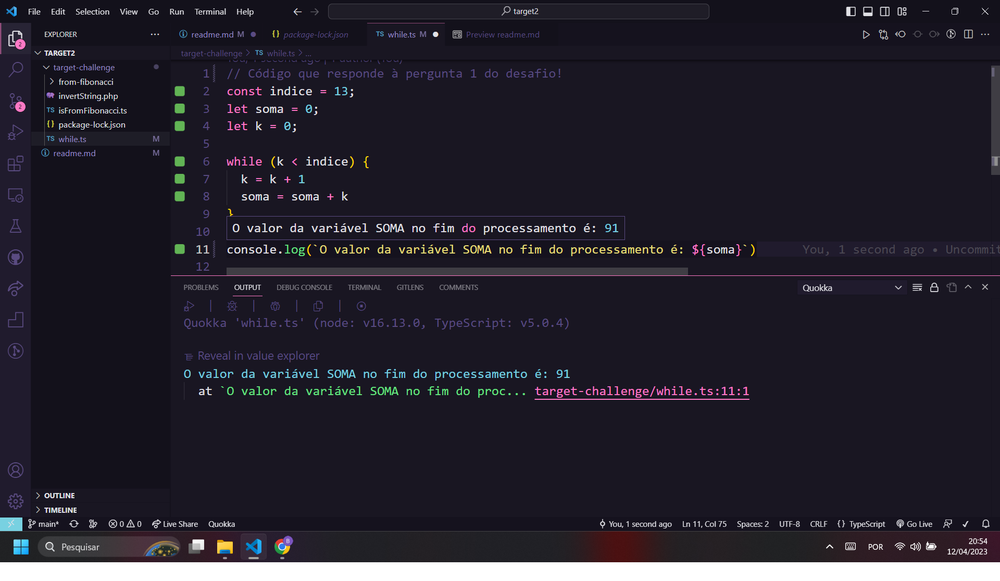

# Desafios Target

Seguem as respostas dos desafios. Em alguns casos a resposta é ilustrada em forma de imagem ou texto, já em outras ela está na forma de links para os repositórios com o código que responde à pergunta/desafio

## Pergunta 1:
_1. Observe o trecho de código abaixo:_

> int INDICE = 13, SOMA = 0, K = 0;
>
>enquanto K < INDICE faça
>
>{
>
>K = K + 1;
>
>SOMA = SOMA + K;
>
>}
>
>
>imprimir(SOMA);
>


_Ao final do processamento, qual será o valor da variável SOMA?_

__RESPOSTA:__
A figura abaixo ilustra uma versão alternativa do código mencionado na pergunta usando a linguagem TypeScript e a extensão Quokka para rodar o código.



O valor da variável _SOMA_, portanto, será __91__ no final do prcessamento.


## Pergunta 2:
 _2. Dado a sequência de Fibonacci, onde se inicia por 0 e 1 e o próximo valor sempre será a soma dos 2 valores anteriores (exemplo: 0, 1, 1, 2, 3, 5, 8, 13, 21, 34...), escreva um programa na linguagem que desejar onde, informado um número, ele calcule a sequência de Fibonacci e retorne uma mensagem avisando se o número informado pertence ou não a sequência._


_IMPORTANTE:_

_Esse número pode ser informado através de qualquer entrada de sua preferência ou pode ser previamente definido no código;_

__RESPOSTA__

A resposta do segundo desafio foi implementada em React.JS, uma biblioteca construída em cima da linguagem JavaScript. Além disso, foi usado TypeScript e CSS Modules para garantir um projeto mais consistente e bonito.

É possível ver como o código funciona na prática no vídeo abaixo:

[Vídeo no YouTube - Conferir se número pertence à sequência de fibonacci](https://youtu.be/ObAEuLe6sjM)

Ou, se você preferir pode baixar o código do link abaixo e rodá-lo na sua máquina:
[Código em React](https://github.com/brianvfarias/target-challenges2/tree/main/target-challenge/from-fibonacci)

***
**_NOTA:_**  É importante ter o Node.JS instalado e rodar os comandos:
```bash
 npm i //para instalar as dependências do código

 e

 npm run dev //para rodar o código
```
***


## Pergunta 3:

_3. Descubra a lógica e complete o próximo elemento:_


*a. 1, 3, 5, 7, _*


*b. 2, 4, 8, 16, 32, 64, __*

*c. 0, 1, 4, 9, 16, 25, 36, __*

*d. 4, 16, 36, 64, __*

*e. 1, 1, 2, 3, 5, 8, __*

*f. 2,10, 12, 16, 17, 18, 19, __*

__RESPOSTA:__


a. 1, 3, 5, 7, __=> 9 (números ímpares)__

b. 2, 4, 8, 16, 32, 64, __=> 128 (2 elevado a _n_)__

c. 0, 1, 4, 9, 16, 25, 36, __=> 49 (_n_ elevado a 2)__

d. 4, 16, 36, 64, __=> 100 (números pares elevados a 2)__

e. 1, 1, 2, 3, 5, 8, __=> 13 (sequência de fibonacci)__

f. 2, 10, 12, 16, 17, 18, 19, __=> 200 (sequência de números que começam com a letra "d")__


## Pergunta 4:
_4. Dois veículos (um carro e um caminhão) saem respectivamente de cidades opostas pela mesma rodovia. O carro de Ribeirão Preto em direção a Franca, a uma velocidade constante de 110 km/h e o caminhão de Franca em direção a Ribeirão Preto a uma velocidade constante de 80 km/h. Quando eles se cruzarem na rodovia, qual estará mais próximo a cidade de Ribeirão Preto?_


_IMPORTANTE:_

_a. Considerar a distância de 100km entre a cidade de Ribeirão Preto <-> Franca._

_b. Considerar 2 pedágios como obstáculo e que o caminhão leva 5 minutos a mais para passar em cada um deles e o carro possui tag de pedágio (Sem Parar)_

_c. Explique como chegou no resultado._

__RESPOSTA:__


Quando os dois veículos se cruzarem, independente do ponto, ambos estarão à mesma distância da cidade de Ribeirão Preto!

Explicação:
Do ponto de vista lógico é simples determinar que os dois veículos estarão à mesma distância da cidade, visto que, por definição, quando eles se cruzam eles se encontram no mesmo ponto da rodovia.

É possível, apesar disso, determinar o ponto da rodovia em que eles se encontram através de alguns cálculos e considerações. Se essa parte da explicação for uma parte importante da avaliação, segue o link da resposta:

[Ponto em que os veículos se encontram - Com cálculos](https://github.com/brianvfarias/target-challenges2/tree/main/target-challenge/explicacao_4)

## Pergunta 5:

_5. Escreva um programa que inverta os caracteres de um string._


_IMPORTANTE:_

_a. Essa string pode ser informada através de qualquer entrada de sua preferência ou pode ser previamente definida no código;_

_b. Evite usar funções prontas, como, por exemplo, reverse;_

__RESPOSTA:__

A resposta do 5º desafio foi implementada usando a linguagem PHP. Além disso, usei Bootstrap para dar um visual mais agradável à aplicação!

É possível ver como o código funciona na prática no vídeo abaixo:

[Vídeo no YouTube - Inverter Texto com PHP](https://youtu.be/Eo0DPNKZB8c)

Ou, se você preferir pode baixar o código do link abaixo e rodá-lo na sua máquina:

[Código em PHP](https://github.com/brianvfarias/target-challenges2/blob/main/target-challenge/invertString.php)

***
**_NOTA:_**  É preciso rodar o código PHP em um servidor ou simular um servidor na sua máquina. Neste caso foi usado o XAMPP!
***
